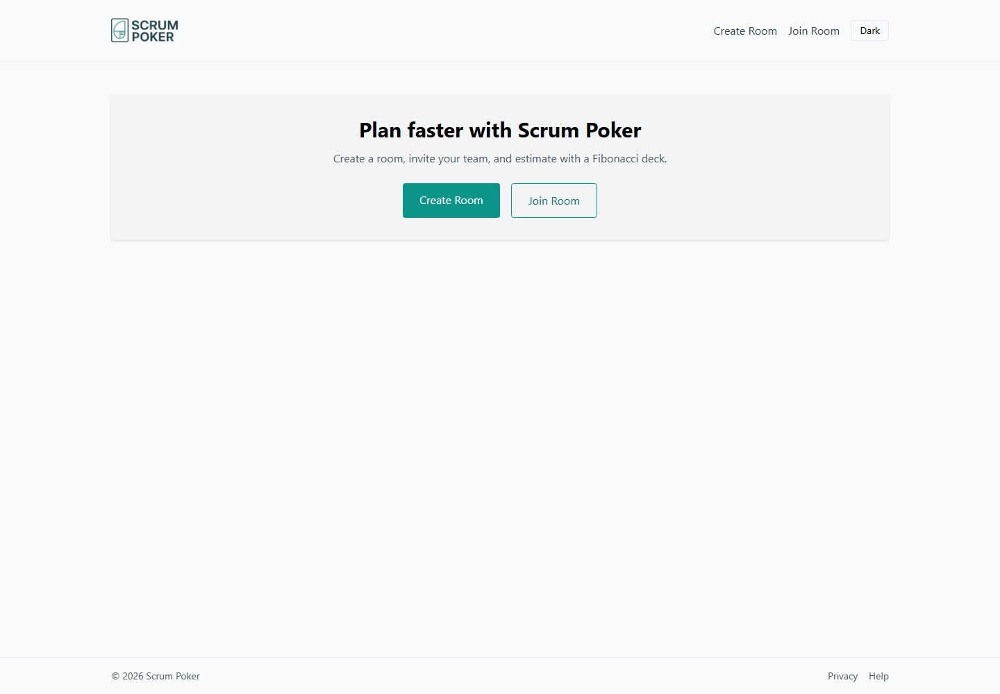
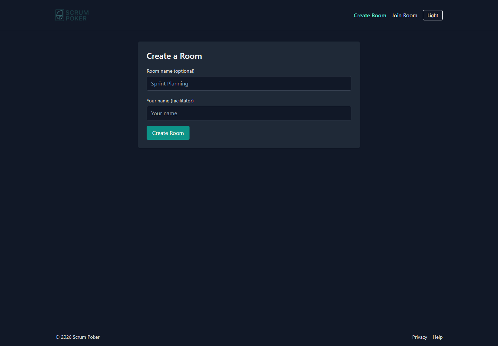
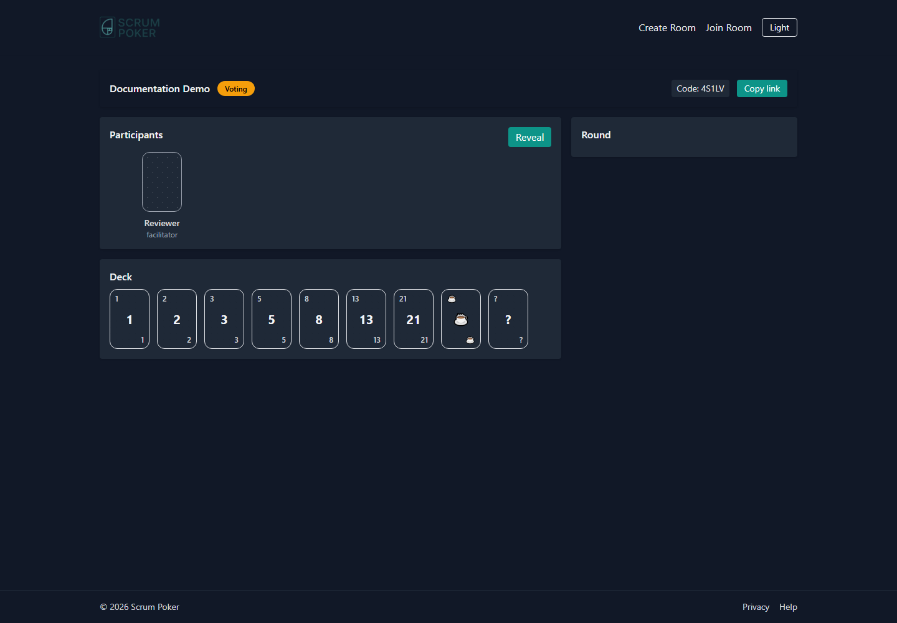
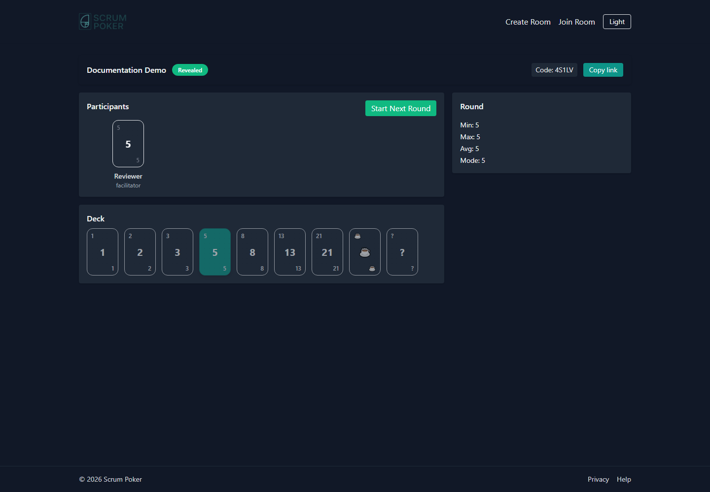
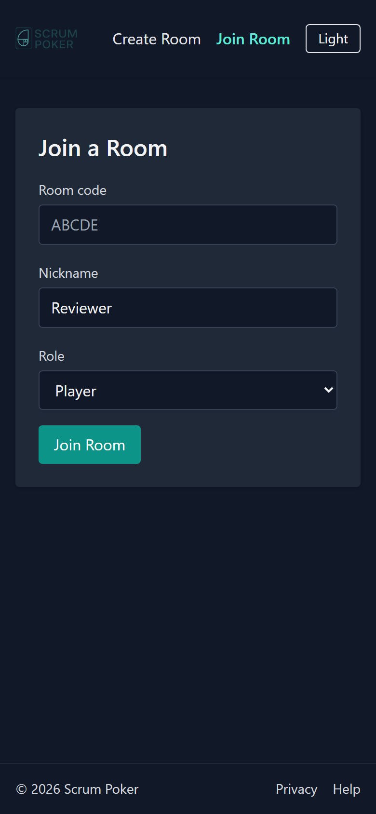
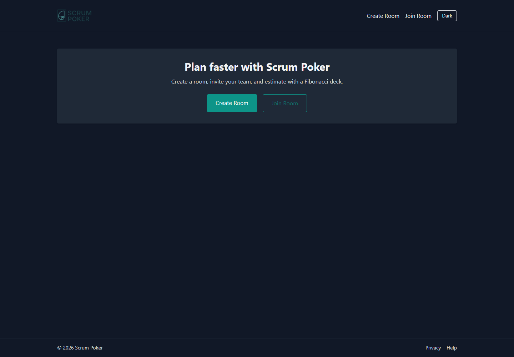

# EstimateCards / Scrum Poker

EstimateCards is a lightweight Scrum Poker web app for collaborative agile story estimation. Teams can create an estimation room, invite participants with a room code or link, vote with a Fibonacci deck, and reveal results when the facilitator is ready.

Live demo: [https://estimatecards.com/](https://estimatecards.com/)

## Repository Purpose

This repository is the public source for EstimateCards. It is intended to be easy to inspect, run, and contribute to while demonstrating practical web product implementation with React, TypeScript, Firebase, realtime collaboration, and security-conscious cloud rules.

## Why I Built This

I built EstimateCards to support agile teams during story estimation, especially when team members are remote or hybrid. The goal is to keep planning sessions simple: create a room, invite the team, vote privately, reveal together, and quickly align around an estimate.

## Features

- Create estimation rooms with short invite codes
- Join by room code or shared link
- Firebase Anonymous Auth for frictionless participant identity
- Fibonacci planning deck with an uncertainty option and coffee card
- Hidden votes until facilitator reveal
- Facilitator-only round start and reveal actions
- Basic result statistics after reveal
- Participant presence and leave indicators
- Light and dark theme toggle
- Responsive layout for desktop and mobile
- Firebase security rules for room-scoped access

## Tech Stack

- React
- TypeScript
- Vite
- TailwindCSS
- React Router
- Firebase Hosting
- Firebase Authentication with anonymous sign-in
- Cloud Firestore
- Firebase Realtime Database for presence

## Architecture Overview

The application is a Vite-powered React single-page app deployed to Firebase Hosting. Firestore stores rooms, participants, rounds, and votes. Realtime Database stores ephemeral presence heartbeats and disconnect events. Firebase Anonymous Auth gives each browser a stable UID used by security rules to scope access to joined rooms.

For more detail, see [docs/ARCHITECTURE.md](docs/ARCHITECTURE.md).

## How It Works

1. A facilitator creates a room.
2. The app creates a Firestore session, facilitator participant, and minimal public room-code lookup.
3. Participants join with the room code or shared link.
4. Participants vote while votes are hidden.
5. The facilitator reveals the round.
6. Votes and summary statistics become visible to room participants.
7. Presence updates show participants who are online or have left recently.

## Local Setup

Requirements:

- Node.js 20 recommended
- npm
- A Firebase project for local integration testing

Install dependencies:

```bash
npm install
```

Create a local environment file:

```bash
cp .env.example .env
```

Fill `.env` with your Firebase web app configuration.

Start the development server:

```bash
npm run dev
```

Build for production:

```bash
npm run build
```

Preview the production build:

```bash
npm run preview
```

## Firebase Setup

In Firebase Console:

1. Create a Firebase project.
2. Add a Web app.
3. Enable Anonymous Authentication.
4. Enable Cloud Firestore.
5. Enable Realtime Database.
6. Configure Firebase Hosting.
7. Deploy Firestore rules from `firestore.rules`.
8. Deploy Realtime Database rules from `database.rules.json`.

Deploy from the Firebase CLI:

```bash
firebase deploy
```

This repository does not auto-deploy from GitHub Actions.

## Environment Variables

Use `.env.example` as the template:

```env
VITE_FIREBASE_API_KEY=
VITE_FIREBASE_AUTH_DOMAIN=
VITE_FIREBASE_DATABASE_URL=
VITE_FIREBASE_PROJECT_ID=
VITE_FIREBASE_STORAGE_BUCKET=
VITE_FIREBASE_MESSAGING_SENDER_ID=
VITE_FIREBASE_APP_ID=
VITE_FIREBASE_MEASUREMENT_ID=
```

Firebase web configuration is public by design. Do not commit `.env` files or service account credentials.

## Available Scripts

- `npm run dev` - start the Vite development server
- `npm run build` - type-check and build the production app
- `npm run preview` - preview the production build locally
- `npm run deploy` - deploy with the Firebase CLI
- `npm run lint` - run ESLint for the React/TypeScript app
- `npm test` - run the Vitest test suite

## Security and Privacy

- Room codes and room links act as invitations.
- Session details, participants, rounds, and votes are readable only by joined participants.
- Users can write only their own participant, vote, and presence data except facilitator-only room actions.
- Firebase web config is not a secret; access control is enforced by Firebase security rules.
- Realtime Database presence writes are scoped to the authenticated user's own UID.
- Consider enabling Firebase App Check for additional abuse protection.
- Never commit `.env`, service account JSON files, private keys, or access tokens.

See [SECURITY.md](SECURITY.md) for reporting guidance.

## Screenshots

### Home Page



### Create Room



### Active Voting Room



### Revealed Results



### Mobile Layout



### Dark Mode



## Roadmap

- Add Firebase App Check
- Improve room lifecycle cleanup
- Add optional story title/link support
- Add facilitator controls for removing inactive participants

## Contributing

Contributions are welcome. Please read [CONTRIBUTING.md](CONTRIBUTING.md) before opening a pull request.

The `main` branch is protected. Changes should be proposed through pull requests.

## License

This project is licensed under the [MIT License](LICENSE).
