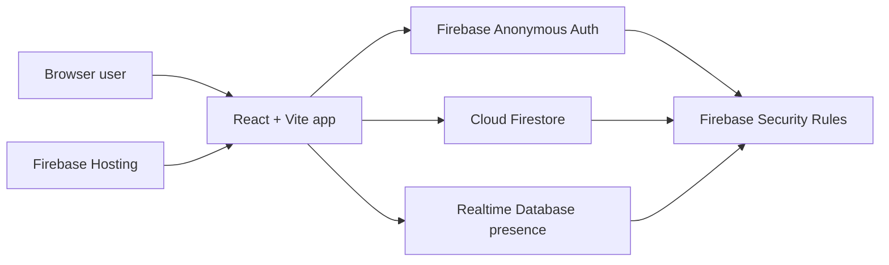

# Architecture

EstimateCards is a single-page React application backed by Firebase services. The app favors a small client codebase and Firebase security rules for room-scoped access control.

## High-Level Diagram



## Frontend Responsibilities

The React app handles:

- Routing between home, create, join, and room views
- Anonymous sign-in initialization
- Room creation and join form UX
- Realtime subscriptions for sessions, participants, rounds, and votes
- Vote casting and facilitator actions
- Participant presence heartbeat
- Light/dark theme preference

## Firebase Authentication

Firebase Anonymous Auth gives every browser session a Firebase UID without requiring a visible login form. That UID is used as:

- The participant document ID
- The vote document ID
- The presence path ID
- The basis for Firestore and Realtime Database rules

## Cloud Firestore

Firestore stores persistent room data:

- `sessions/{sessionId}`: room metadata, room code, facilitator UID, deck, active round
- `sessions/{sessionId}/participants/{uid}`: nickname, role, presence metadata
- `sessions/{sessionId}/rounds/{roundId}`: round status and timestamps
- `sessions/{sessionId}/rounds/{roundId}/votes/{uid}`: participant vote
- `roomCodes/{code}`: minimal public lookup from short code to session ID

## Realtime Database Presence

Realtime Database stores ephemeral presence under:

```txt
presence/{sessionId}/{uid}
```

The client writes heartbeats and registers `onDisconnect` cleanup. Realtime Database rules restrict writes to the authenticated user's own UID path.

## Firebase Hosting

Firebase Hosting serves the static production build from `dist/` and rewrites all routes to `index.html` for React Router.

## Room and Session Flow

1. Facilitator signs in anonymously.
2. App creates a session document.
3. App creates a facilitator participant document.
4. App creates a minimal `roomCodes/{code}` lookup document.
5. The facilitator shares the code or join link.

## Join Flow

1. Participant signs in anonymously.
2. App reads `roomCodes/{code}`.
3. App writes the participant's own participant document with the matching join code.
4. Firestore rules validate the code against the target session.
5. Participant can now read room data.

## Voting and Reveal Flow

1. Facilitator starts a round.
2. Players and facilitators can write their own vote while the round is in `voting`.
3. Spectators cannot vote.
4. Votes are hidden in the UI until the round status is `revealed`.
5. Facilitator reveals the round.
6. Client computes basic statistics from revealed numeric votes.

## Security Rules Overview

Firestore rules enforce:

- Only joined participants can read session internals.
- Users can create/update only their own participant document.
- Users can create/update only their own vote document.
- Facilitator-only room and round actions.
- Vote values are restricted to the supported deck.
- Public room-code documents expose only minimal lookup data.

Realtime Database rules enforce:

- Users can read/write only their own presence path.
- All other reads and writes are denied.

## Limitations and Future Improvements

- Existing rooms created before room-code lookup documents may not be joinable by code.
- There are no automated browser tests yet.
- ESLint is not fully configured in the root project.
- App Check is recommended but not yet enabled.
- Presence cleanup is best effort and depends on browser/network behavior.
- Room lifecycle cleanup and archival are future improvements.
